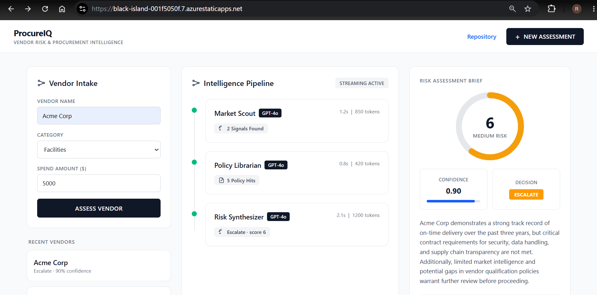
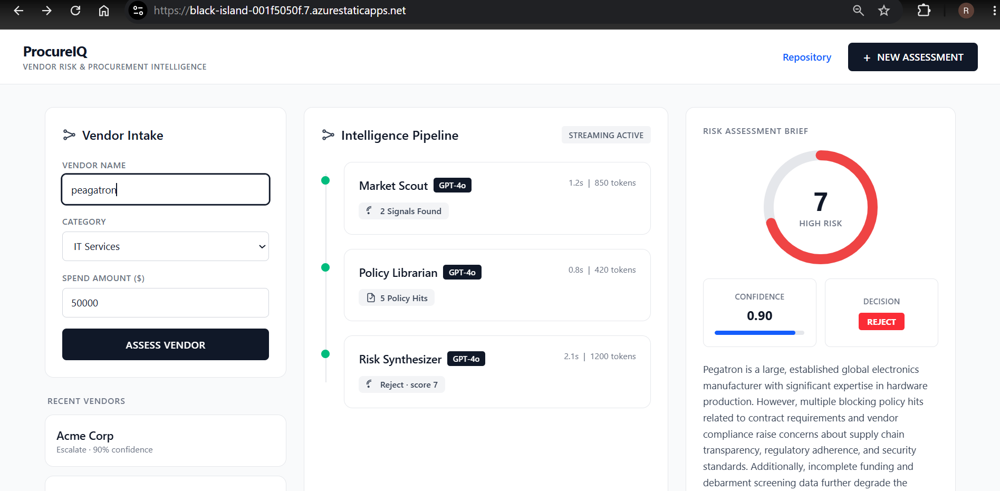
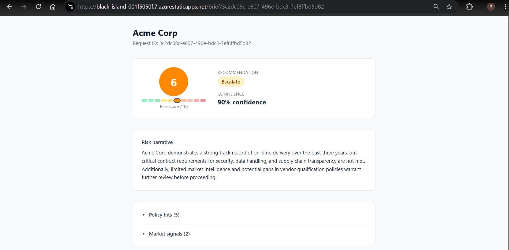
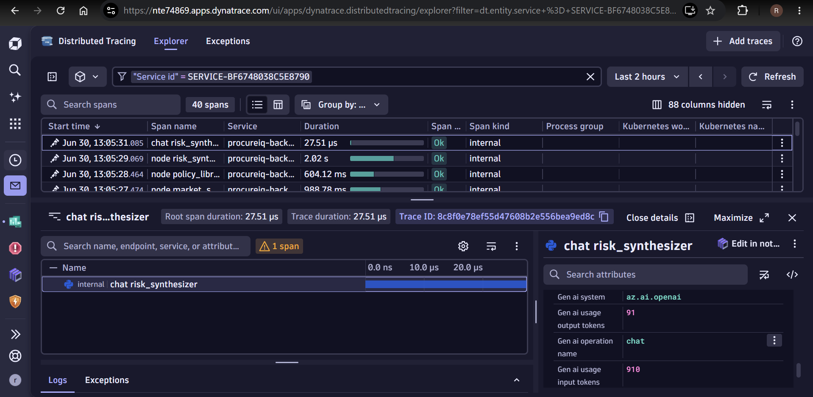
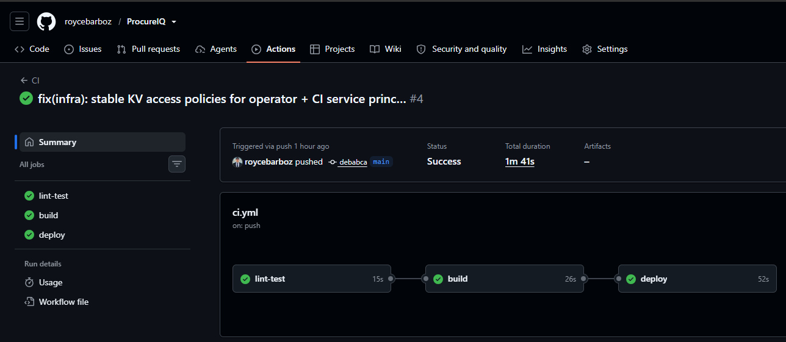

# ProcureIQ — Vendor Risk & Procurement Intelligence Copilot

> A multi-agent AI system that turns a vendor name into an auditable risk brief in seconds — and **degrades honestly** when data is missing instead of faking confidence.

Enterprise procurement teams vet vendors by hand: cross-referencing market signals, internal policy, and spend history. ProcureIQ automates that with three coordinated LLM agents, streams their progress live, and produces a scored, sourced recommendation a human can defend in an audit.

Built as a full-stack, production-shaped showcase: **LangGraph** agent orchestration, **FastAPI + SSE** streaming, a **React/TypeScript** UI, **Azure** infrastructure as code, a **CI/CD** pipeline, and **AI observability** via Dynatrace/OpenTelemetry.

---

## Screenshots


### 1. Assessment workspace

*Single-screen workspace: vendor intake → live intelligence pipeline → risk brief.*

### 2. Live pipeline with graceful degradation

*The three agents streaming via SSE, with a ⚠ "Partial Data" warning on a degraded source. 

### 3. Risk brief

*Score gauge, confidence, decision badge, narrative, and expandable market signals / policy hits.*

### 4. AI observability in Dynatrace

*Distributed trace of one assessment with per-call GenAI spans (model, input/output tokens, cost).*

### 5. CI/CD pipeline

*Green `lint-test → build → deploy` run.*

---

## What it does

- **Three-agent pipeline** (LangGraph): **Market Scout** (web + ERP signals) → **Policy Librarian** (semantic policy retrieval) → **Risk Synthesizer** (scored brief).
- **Live streaming** — each agent's result streams to the UI over Server-Sent Events as it completes.
- **Honest degradation** — when a source times out, the UI shows exactly what's missing, the risk score is capped, and confidence drops. Dual failure routes to human review instead of inventing a score.
- **Auditable** — every assessment carries a `request_id` traceable from UI → API → agent spans in Dynatrace.
- **Scored output** — 1–10 risk score, confidence, and an Approve / Escalate / Reject / Pending recommendation with a cited narrative.

## Architecture

```
React + Vite (Static Web App)
        │  SSE  ▲
        ▼       │
FastAPI  ──►  LangGraph
        market_scout → policy_librarian →(conditional)→ risk_synthesizer
                                          └─ dual failure → human_review
        │            │                │
   Tavily/ERP   Azure AI Search   Azure OpenAI (gpt-4o)
        │
   OpenTelemetry (OTLP) ──► Dynatrace  (traces, metrics, GenAI/AI spans)
```

Deployed on Azure Container Apps (backend) + Static Web Apps (frontend), provisioned with Terraform, shipped by GitHub Actions.

## Tech stack

| Layer | Tech |
|---|---|
| Agents | LangGraph (single flat graph, conditional routing) |
| LLM | Azure OpenAI `gpt-4o`; `text-embedding-3-small` |
| Retrieval | Azure AI Search (semantic policy corpus) |
| API | FastAPI + SSE (`sse-starlette`) |
| Frontend | React + TypeScript + Vite + Tailwind |
| Observability | OpenTelemetry → Dynatrace (infra + AI/LLM) |
| Infra | Terraform → Azure Container Apps, Static Web Apps, Key Vault, ACR |
| CI/CD | GitHub Actions (lint-test → build → deploy) |
| Tests | pytest (55 backend) + Vitest (38 frontend) |

## Engineering highlights

- **Resilience as a first-class feature** — a full failure matrix (source timeout, partial data, zero retrieval, dual failure) with pure, exhaustively-tested routing and confidence functions.
- **GenAI observability** — LLM calls emit OpenTelemetry GenAI-convention spans (model, token usage, derived cost) instead of hardcoded UI numbers — real, queryable telemetry.
- **Testable by design** — business logic mocked at the boundary; pipeline integration tests run with no cloud credentials.
- **Reproducible infra** — remote-state Terraform, secrets in Key Vault via managed identity, one-command deploy.

## Running locally

```bash
# Backend
cd backend && uv sync && uv run uvicorn api:app --reload     # needs backend/.env (see .env.example)
# Frontend
cd frontend && npm install && npm run dev
```

Tests:
```bash
cd backend && uv run pytest          # 55 tests
cd frontend && npx vitest run        # 38 tests
```

---

## Infrastructure

All Azure resources are provisioned via Terraform in `infra/`. The backend uses Azure Storage Account for remote state.

### One-time bootstrap (run once before `terraform init`)

Create the storage account that holds Terraform remote state. These resources are intentionally outside Terraform management.

```bash
# Set variables
RESOURCE_GROUP="rg-procureiq-tfstate"
STORAGE_ACCOUNT="stprocureiqtfstate"
CONTAINER="tfstate"
LOCATION="eastus"

# Create resource group
az group create --name $RESOURCE_GROUP --location $LOCATION

# Create storage account
az storage account create \
  --name $STORAGE_ACCOUNT \
  --resource-group $RESOURCE_GROUP \
  --location $LOCATION \
  --sku Standard_LRS \
  --encryption-services blob

# Create blob container
az storage container create \
  --name $CONTAINER \
  --account-name $STORAGE_ACCOUNT
```

### Deploy infrastructure

After the bootstrap step:

```bash
cd infra

# Copy and edit the vars file
cp terraform.tfvars.example terraform.tfvars
# Set subscription_id (and dynatrace_env_url) in terraform.tfvars

# Remote state uses a partial backend — supply state config at init:
cp backend.hcl.example backend.hcl
terraform init -backend-config=backend.hcl
terraform plan
terraform apply
```

### Resources provisioned

| Resource | Name |
|---|---|
| Resource Group | `rg-procureiq-prod` |
| Container Registry | `crprocureiqprod` |
| Key Vault | `kv-procureiq-prod` |
| Log Analytics Workspace | `law-procureiq-prod` (Azure platform/system logs only) |
| Azure OpenAI (`gpt-4o` + `text-embedding-3-small`) | `oai-procureiq-prod` |
| Azure AI Search | `srch-procureiq-prod` |
| Container Apps Environment + App | `cae-procureiq-prod` / `ca-procureiq-backend-prod` |
| Static Web App | `stapp-procureiq-frontend-prod` |

> **Observability** is **Dynatrace** (external SaaS), not an Azure resource. The backend exports app + AI spans via OTLP (`DT_ENV_URL` + `DT_API_TOKEN`); infra telemetry comes from the Dynatrace Azure-native integration (Container Apps has no OneAgent sidecar path). The Dynatrace environment URL and ingest token are stored in Key Vault. Log Analytics is retained only for Azure platform/system logs.

### Variables

| Variable | Default | Description |
|---|---|---|
| `subscription_id` | — | Azure subscription ID (required) |
| `location` | `eastus` | Azure region |
| `environment` | `prod` | Deployment environment |
| `openai_gpt4o_capacity` | `30` | gpt-4o TPM (thousands) |
| `openai_embedding_capacity` | `120` | embedding TPM (thousands) |
| `dynatrace_env_url` | `""` | Dynatrace environment URL for OTLP (no trailing slash) |

## CI/CD

`.github/workflows/ci.yml` runs three jobs on push to `main` (PRs run lint/test/build only):

1. **lint-test** — `ruff check` + `pytest` on `backend/`. Any failure blocks the rest.
2. **build** — `docker build ./backend` → push to ACR (tags: commit SHA + `latest`).
3. **deploy** — `terraform apply` (idempotent infra) + `az containerapp update` (rolls out the new image).

### Required GitHub secrets

| Secret | Purpose |
|---|---|
| `AZURE_CREDENTIALS` | Service-principal JSON for `azure/login` (ACR push, Terraform, Container App update) |
| `ACR_LOGIN_SERVER` | e.g. `crprocureiqprod.azurecr.io` |
| `ARM_SUBSCRIPTION_ID` | Azure subscription ID → `TF_VAR_subscription_id` |
| `DT_ENV_URL` | Dynatrace env URL → `TF_VAR_dynatrace_env_url` |
| `TF_BACKEND_RESOURCE_GROUP` | Terraform remote-state resource group |
| `TF_BACKEND_STORAGE_ACCOUNT` | Terraform remote-state storage account |
| `TF_BACKEND_CONTAINER` | Terraform remote-state blob container |
| `TF_BACKEND_KEY` | Terraform remote-state key (blob name) |

> The Dynatrace **ingest token** (`dynatrace-api-token`) lives in Key Vault, not GitHub — the Container App reads it at runtime via managed identity.
